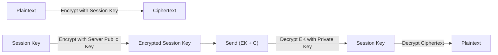
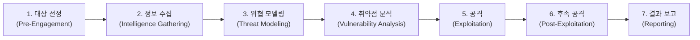

# 🛡️ Information Security Notes
---

## 목차

- [1. 보안 솔루션 기본 구조](#1-보안-솔루션-기본-구조)
- [2. 관련 법률/정책(국내)](#2-관련-법률정책국내)
- [3. 암호학 기초](#3-암호학-기초)
- [4. 대칭키 암호](#4-대칭키-암호)
- [5. 공개키(비대칭키) 암호](#5-공개키비대칭키-암호)
- [6. 하이브리드 암호 시스템](#6-하이브리드-암호-시스템)
- [7. 인증서와 전자서명](#7-인증서와-전자서명)
- [8. CIA 보안 3요소](#8-cia-보안-3요소)
- [9. 네트워크 기초: OSI 7계층 vs TCP/IP](#9-네트워크-기초-osi-7계층-vs-tcpip)
- [10. TLS/HTTPS](#10-tlshttps)
- [11. VPN 개념과 계층](#11-vpn-개념과-계층)
- [12. 모의해킹: PTES](#12-모의해킹-ptes)

---

## 1. 보안 솔루션 기본 구조

```
Internet → (F/W) → Internal Network
```

| 솔루션 | 한 줄 설명 | 예시 |
| --- | --- | --- |
| **Firewall (F/W)** | 정책 기반으로 트래픽을 **허용/차단** | firewalld, iptables/nftables |
| **IDS** | 침입 징후를 **탐지**(알림/로그) | Snort, Suricata |
| **IPS** | 침입 징후를 **탐지 후 차단**(인라인) | (장비/솔루션 형태로 제공) |
| **UTM** | 여러 보안 기능을 **통합 제공** | 방화벽 + IPS + VPN + AV 등 |

> 참고: **WAF**(웹 방화벽)는 보통 UTM에 포함되기도 하지만, 제품/구성에 따라 **별도 장비/서비스**로 운영되는 경우도 많습니다.
> 

---

## 2. 관련 법률/정책(국내)

- **정보통신망법** (정보통신 이용 촉진 및 정보보호 등에 관한 법률)
- **개인정보보호법** 및 시행령
- **정보통신기반 보호법**
- **전자서명법**
- (학습 확장) **클라우드 관련 규정/가이드**, **위치정보법** 등

---

## 3. 암호학 기초

| 용어 | 의미 |
| --- | --- |
| **평문 (Plaintext)** | 원본 데이터 |
| **암호문 (Ciphertext)** | 암호화된 데이터 |
| **암호화 (Encryption)** | 평문 → 암호문 |
| **복호화 (Decryption)** | 암호문 → 평문 |
| **암호 해독 (Cryptanalysis)** | 암호화 알고리즘/구현을 분석해 깨려는 시도 |
| **키 (Key)** | 암·복호화에 쓰는 값 |
| **암호시스템 (Cryptosystem)** | 알고리즘 + 키 + 운영 방식의 조합 |

### 양방향(복호화 가능) vs 단방향(복호화 불가)

- **대칭키 / 공개키 암호**: 복호화 가능(키가 있어야 함)
- **해시(Hash)**: 복호화 불가(일방향). 무결성 검증 등에 사용

### 해시 함수 분류

#### ✅ 암호학적 해시 함수

- MD5(128bit) *(현재는 충돌 취약점으로 보안 용도 비권장)*
- SHA-1(160bit) *(현재는 보안 용도 비권장)*
- SHA-2: SHA-224/256/384/512 *(실무 표준)*

> 핵심: 암호학적 해시는 **충돌 저항성**(Collision Resistance) 등이 중요합니다.
> 

#### 일반(비암호학적) 해시/검증

- CRC, Checksum, FCS
    
    → 오류 검출에는 유용하지만 **공격자 방어 목적**(무결성/서명)으로는 부족한 경우가 많음
    

---

## 4. 대칭키 암호

- **암호화 키 = 복호화 키**
- 장점: 빠름 / 단점: 키 공유(배포)가 어렵고 노출 시 위험

| 분류 | 특징 | 예시 |
| --- | --- | --- |
| **블록 암호** | 정해진 블록 단위로 암호화 | DES, AES, IDEA / (국내) SEED, ARIA, LEA, HIGHT |
| **스트림 암호** | 1bit 또는 1byte 단위로 암호화 | RC4 *(현재는 보안 용도 비권장)* |

---

## 5. 공개키(비대칭키) 암호

- **암호화 키 ≠ 복호화 키**
- 장점: 키 배포가 상대적으로 쉬움 / 단점: 대칭키보다 느림

| 기반 | 알고리즘 예시 |
| --- | --- |
| **소인수분해 기반** | RSA, Rabin |
| **이산대수/타원곡선 기반** | Diffie–Hellman(키 교환), DSA, ElGamal, ECC |

---

## 6. 하이브리드 암호 시스템

실제 서비스(예: HTTPS)는 보통 **대칭키 + 공개키**를 같이 씁니다.

- 데이터(본문)는 빠른 **대칭키**로 암호화
- 대칭키(세션 키)는 **공개키 암호**로 안전하게 교환/전달



---

## 7. 인증서와 전자서명

- **CA(Certificate Authority)**: 인증서 발급 기관
- **인증서(공개키 인증서)**: “이 공개키는 이 주체의 것이다”를 **검증 가능한 형태로 묶은 문서**
- **전자서명(Digital Signature)**: 보통 “해시값을 개인키로 서명”해서 **무결성 + 서명자 확인 + 부인방지**를 제공

---

## 8. CIA 보안 3요소

| 요소 | 의미 | 대표 위협 | 대표 대응 |
| --- | --- | --- | --- |
| **Confidentiality (기밀성)** | 허가된 대상만 접근 | Sniffing, Eavesdropping | 암호화(Encryption), 접근통제 |
| **Integrity (무결성)** | 변조/삭제/위조 방지 | 변조, 악성코드 | 해시/서명, 접근통제, 감사로그 |
| **Availability (가용성)** | 필요할 때 정상 이용 | DoS/DDoS, 장애 | 이중화, 레이트 리밋, WAF/방화벽 |

---

## 9. 네트워크 기초: OSI 7계층 vs TCP/IP

### OSI 7 Layer

- **L1 물리 (Physical)**: 전기/광 신호, 케이블, 커넥터, 허브 등
- **L2 데이터 링크 (Data Link)**: 프레임, MAC, 스위칭(VLAN), 오류 검출(CRC)
- **L3 네트워크 (Network)**: IP, 라우팅, ICMP
- **L4 전송 (Transport)**: TCP/UDP, 포트, 종단 간 통신
- **L5 세션 (Session)**: 세션 생성/유지/종료(대화 제어)
- **L6 표현 (Presentation)**: 데이터 표현(인코딩), 압축, *암호화 등의 “표현 변환” 관점*
- **L7 응용 (Application)**: HTTP, DNS, SMTP 등

### TCP/IP (일반적 4계층)

- **Link/Network Access**: OSI L1~L2
- **Internet**: OSI L3
- **Transport**: OSI L4
- **Application**: OSI L5~L7

> 메모: “TLS가 OSI 몇 계층인가”는 문맥에 따라 다르게 말하곤 하지만, 보통 **전송 계층 위/응용 계층 아래에서 동작하는 보안 계층** 정도로 이해하면 헷갈림이 줄어듭니다.
> 

---

## 10. TLS/HTTPS

- **TLS(Transport Layer Security)**: 현재 표준 암호화 프로토콜
- **SSL(Secure Sockets Layer)**: TLS의 이전 버전. 현재는 **deprecated(비권장/사실상 사용 금지 수준)**로 보는 게 일반적
- **HTTPS = HTTP + TLS**
    - 기밀성(암호화)
    - 무결성(변조 방지)
    - 서버 인증(필요 시 클라이언트 인증도 가능)

---

## 11. VPN 개념과 계층

**VPN(Virtual Private Network)**: 공용망(인터넷)에서 사설망처럼 안전하게 통신하기 위한 기술

핵심 키워드

- **Tunneling(터널링)**: 원래 패킷을 캡슐화해 운반
- **Authentication(인증)**: 사용자/장비 확인
- **Encryption(암호화)**: 도청 방지
- **Integrity(무결성)**: 변조 탐지

### 계층별 예시

- **L3 VPN: IPsec**
    - IP 패킷 보호(암호화/무결성/인증)
    - IKE(키 교환), AH/ESP 등
- **L2 VPN: L2TP**
    - L2 프레임 터널링
    - 보통 **L2TP/IPsec**로 함께 사용
- **TLS VPN(SSL VPN)**: 브라우저/클라이언트 기반 접근 제어에 유리

추가 메모

- **PPTP**: 오래된 방식. 보안 취약점으로 현재 비권장
- **L2F**: 구형 터널링(현재는 거의 사용 X)
- **L2TP**: IETF 표준(RFC 2661)

---

## 12. [모의해킹] PTES



- **취약점 분석**: 스캔·수동 점검, 오탐 제거, 영향도·재현성 평가
- **공격**: 침투 가능성 **증명**, 증거(Proof) 확보, 영향 범위 확인
- **후속 공격**: 권한 상승·횡적 이동 등 추가 영향 평가, 방어 포인트 도출
- **결과 보고**: 재현 절차·영향·원인·증거 정리, 개선안 및 재점검 권고