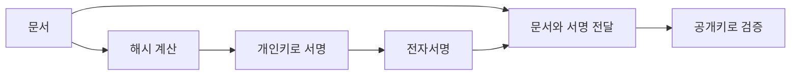

# 인증서와 전자서명

인증서와 전자서명은 공개키가 누구의 것인지 확인하고, 데이터가 변조되지 않았는지 검증하는 데 사용된다.

## 공개키 인증서

공개키 인증서는 특정 주체와 공개키를 연결해 주는 전자 문서이다. 웹사이트 인증서에는 보통 다음 정보가 포함된다.

- 주체 이름
- 공개키
- 발급자
- 유효 기간
- 서명 알고리즘
- 발급자의 전자서명

CA(Certificate Authority)는 인증서를 발급하고 서명하는 기관이다. 브라우저나 운영체제는 신뢰할 수 있는 루트 CA 목록을 가지고 있고, 서버 인증서를 검증할 때 이 신뢰 체인을 확인한다.

## 전자서명

전자서명은 데이터를 개인키로 직접 암호화한다기보다, 보통 데이터의 해시값에 대해 개인키로 서명하고 공개키로 검증하는 방식으로 설명하는 편이 정확하다.

## 암호화와 서명의 차이

| 구분 | 사용하는 키 | 목적 |
| --- | --- | --- |
| 공개키 암호화 | 수신자의 공개키로 암호화, 수신자의 개인키로 복호화 | 기밀성 |
| 전자서명 | 서명자의 개인키로 서명, 서명자의 공개키로 검증 | 무결성, 서명자 확인, 부인방지 |

## 용어 주의

`공인인증서`, `공동인증서`, `전자서명인증서비스`는 법령과 제도 변화에 따라 표현이 달라질 수 있다. 법률 설명은 [국내 정보보안 관련 법률 정리](../foundations/korean-security-laws.md)에서 따로 다루고, 이 문서에서는 암호학적 개념 중심으로 정리한다.
