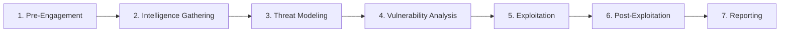

# PTES 모의해킹 절차 개요

PTES(Penetration Testing Execution Standard)는 모의해킹 수행 절차를 단계별로 정리한 방법론이다. 이 문서는 공격 수행 방법이 아니라, 허가된 범위 안에서 보안 점검을 어떻게 구조화하는지 이해하기 위한 학습용 개요이다.

## 전체 흐름

## 단계별 의미

| 단계 | 의미 |
| --- | --- |
| Pre-Engagement | 범위, 기간, 목표, 승인, 법적 책임, 운영 리스크를 합의한다. |
| Intelligence Gathering | 허가된 범위에서 대상 자산과 공격 표면을 파악한다. |
| Threat Modeling | 중요한 자산, 신뢰 경계, 가능한 위협 시나리오를 정리한다. |
| Vulnerability Analysis | 취약점을 식별하고 오탐을 줄이며 영향도를 평가한다. |
| Exploitation | 승인된 범위 안에서 취약점의 실제 영향을 검증한다. |
| Post-Exploitation | 추가 영향 범위와 방어 포인트를 확인한다. |
| Reporting | 재현 조건, 영향, 증거, 원인, 개선안, 재점검 항목을 문서화한다. |

## 문서화 기준

GitHub 포트폴리오에서는 구체적인 공격 수행 절차보다 다음 내용을 중심으로 정리한다.

- 허가된 범위 안에서 수행한다.
- 재현 가능한 근거와 증거를 남긴다.
- 운영 서비스에 영향을 주지 않도록 주의한다.
- 최종 목적은 침투 자체가 아니라 개선안 도출이다.
- 보고서에는 위험도, 영향도, 수정 방안, 재점검 기준을 포함한다.

## 표현 주의

원본 메모에는 침투, 권한 상승, 백도어 관리, 흔적 지우기 같은 공격 단계 표현이 있다. 포트폴리오 문서에서는 이를 실제 공격 안내로 확장하지 않고, 승인된 보안 점검에서 영향도와 방어 포인트를 확인하는 단계로 설명한다.
